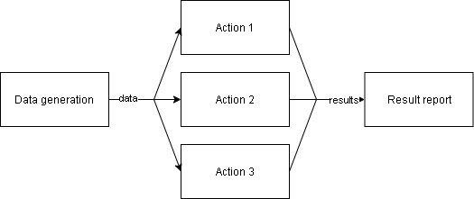

# phf
phf — ProviderHookFramework is a python framework for developing async applications in the following way:



## Main idea of phf:
1. A content provider somehow yields some data. 
2. Hooks, that are linked to the provider, process the data or execute actions.
3. Results of all hooks are gathered back to provider for a report.

## Prerequisites
* Python >= 3.5
* aioconsole
* aiohttp
* aiofiles
* pytest and pytest_asyncio for testing

## Installation

Just download the newest release and install it with pip.

Also you can build it yourself:

1. Clone the repo and navigate to the repo root folder.
2. Download setuptools and wheel: ```python -m pip install --user --upgrade setuptools wheel```
3. ```python setup.py sdist bdist_wheel```
4. Navigate to dist and install one of files from there with ```pip install ...```

## Basic usage
The following code creates a system, where MyProvider object yields an int every 
second, and hooks check whether the int is divisible by 2 or 3:
```
import random

from phf.provider import PeriodicContentProvider
from phf.abstracthook import AbstractHook
from phf.phfsystem import PHFSystem


class MyProvider(PeriodicContentProvider):
    def __init__(self, *args, **kwargs):
        super().__init__(period=1, *args, **kwargs)

    async def get_content(self):
        return random.randint(0, 10)

    async def result_callback(self, result):
        print(result)


class DivisionCheckHook(AbstractHook):
    def __init__(self, a, *args, **kwargs):
        super().__init__(*args, **kwargs)
        self._a = a

    async def hook_action(self, data):
        if data % self._a == 0:
            return f"{data} divided by {self._a} without remainder"
        else:
            return f"{data} divided by {self._a} with remainder"


phfsys = PHFSystem() 
my_provider = MyProvider()
hook_one = DivisionCheckHook(2)
hook_two = DivisionCheckHook(3)

phfsys.add_provider(my_provider) # Link provider to the system

# Link hooks to the provider
my_provider.add_hook(hook_one) 
my_provider.add_hook(hook_two)

# Start the phfsys. The operation blocks the thread.
phfsys.start() 
```
Results:
```['1 divided by 2 with remainder', '1 divided by 3 with remainder']
['10 divided by 2 without remainder', '10 divided by 3 with remainder']
['4 divided by 2 without remainder', '4 divided by 3 with remainder']
['6 divided by 2 without remainder', '6 divided by 3 without remainder']
['8 divided by 2 without remainder', '8 divided by 3 with remainder']
```
## Customize
### Providers
#### ConsistentContentProviders
Now there are 2 types of ConsistentContentProviders, which use get_content and
result_callback for working:
1. phf.provider.PeriodicContentProvider — provider, that yields data every period seconds.
It shouldn't run thread-blocking operations.
2. phf.provider.BlockingContentProvider — provider, that yields data without stopping. 
As this provider runs it's get_content() in a different thread, you may run blocking 
operations in it freely.

In general, their work can be described in the following code(not the exact implementation):
```
while True:
    data = self.get_content()
    result = []
    for hook in self.hooks:
        result.append(hook.hook_action(data))
    self.result_callback(result)
```
#### ComplexContentProvider
Class phf.provider.ComplexContentProvider may be used in cases where 
ConsistentContentProviders can't be applied(for example, when data is recieved from a server).

To deal with it ComplexContentProvider uses MessageSystem objects.

Example:
provider is ComplexContentProvider, PHFSystem is running in a different thread.

```
# Getting the MessageSystem
message_sys = provider.get_message_system()

# Sending a message, return value is the id of the message
msg_id = message_sys.send_to_provider("Hello!")

# Retrieve the result by message's id.
result = message_sys.retrieve_result(msg_id)
```

You may also just use ```MessageSystem.send_wait_answer(data)```, which sends a message 
and waits for result. 

If you want to somehow modify the data, that was sent to the ComplexContentProvider or
result that will be sent back, you can overrider:
* ```async def preprocess_data(self, content: object)```
* ```async def postprocess_result(self, results: typing.List[object]) -> object:```
